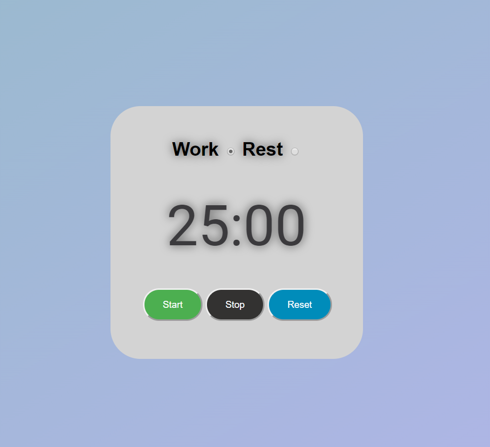

 ## Pomodoro Timer

 Follow this Pomodoro Timer during intense study sessions to prevent burnout and maximize your focused effort!  

 

 Try it out here: [Pomodoro Timer](https://rfussell17.github.io/pomodoro/)

 

 

##  Summary
 This is my Pomodoro Timer project that is built with HTML, CSS and vanilla JS. No Libraries or Frameworks were used. The Timer has a Work mode (25 min) and a Rest mode (5 min). It has Start, Stop and Reset functions to allow more freedom with how the app is used.

**Author**
 
**Robin Fussell** _- Software Developer_ | [LinkedIn](https://www.linkedin.com/in/robin-fussell17/)
